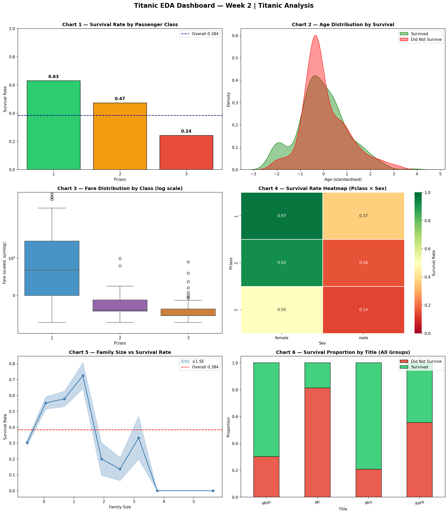

# -AIML-Internship-Week2-Muhamamd-Mahad
Titanic EDA — NumPy & Pandas deep dive with feature engineering, survival analysis, and ML-ready dataset preparation.

## Overview
This repository contains an exploratory data analysis (EDA) and data visualization project based on the famous Titanic dataset. The goal of this project is to analyze the factors that influenced passenger survival during the tragic Titanic disaster.

**Author:** Muhammad Mahad

## Dataset Information
The primary dataset used in this project is the **Titanic Survival Dataset** (processed as `titanic_cleaned.csv`). It contains detailed demographic and travel information for the passengers aboard the Titanic. Key features include:

- **Demographics:** Age, Sex
- **Socio-Economic Status:** Ticket Class (1st, 2nd, 3rd class)
- **Family Details:** Number of siblings/spouses aboard (`SibSp`), number of parents/children aboard (`Parch`)
- **Travel Information:** Passenger Fare, Port of Embarkation (Cherbourg, Queenstown, Southampton)
- **Target Variable:** Survival Status (0 = Did not survive, 1 = Survived)

## Top 3 Survival Insights
Based on the in-depth data analysis, the following critical insights were discovered regarding passenger survival:

1. **Gender Played a Crucial Role (Women and Children First):** 
   Females had a drastically higher survival rate (approximately 74%) compared to males (around 19%). This clearly reflects the historical "women and children first" rescue protocol followed during the evacuation.
   
2. **Socio-Economic Status Mattered Significantly:** 
   Passengers holding 1st-class tickets were much more likely to survive than those in 2nd or 3rd class. The survival rate dropped significantly as the passenger class lowered, highlighting that wealthier passengers had better access to lifeboats.
   
3. **Family Size Impacted Survival Odds:** 
   Passengers traveling with a small family (1 to 3 accompanying members) had better survival odds than those who traveled completely alone. However, individuals in very large families faced the lowest survival rates, likely due to the difficulty of keeping a large group together during the chaotic evacuation.

## Visualizations
Below is a visual representation showcasing key insights and exploratory data analysis from the dataset:

## Tools & Technologies Used
The following tools, libraries, and frameworks were utilized to clean, analyze, and visualize the data:
- **Programming Language:** Python
- **Environment:** Jupyter Notebook (`titanic_week2_fixed (1).ipynb`)
- **Data Manipulation & Cleaning:** Pandas, NumPy
- **Data Visualization:** Matplotlib, Seaborn
